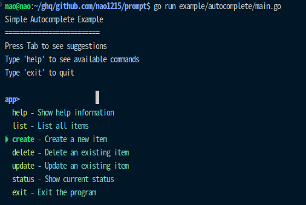

# prompt

[](https://pkg.go.dev/github.com/nao1215/prompt)
[](https://goreportcard.com/report/github.com/nao1215/prompt)
[](https://github.com/nao1215/prompt/actions/workflows/unit_test.yml)

[日本語](./doc/ja/README.md) | [Русский](./doc/ru/README.md) | [中文](./doc/zh-cn/README.md) | [한국어](./doc/ko/README.md) | [Español](./doc/es/README.md) | [Français](./doc/fr/README.md)


**prompt** is a simple terminal prompt library for Go that provides powerful interactive command-line interfaces. This library is designed as a replacement for the unmaintained [go-prompt](https://github.com/c-bata/go-prompt) library, addressing critical issues while adding enhanced functionality and better cross-platform support.



## ✨ Features

- 🖥️ **Cross-Platform Support** - Works seamlessly on Linux, macOS, and Windows
- 🔍 **Auto-Completion** - Tab completion with fuzzy matching and customizable suggestions
- 📚 **Command History** - Navigation with arrow keys, persistent history, and reverse search (Ctrl+R)
- ⌨️ **Key Bindings** - Comprehensive shortcuts including Emacs-style navigation
- 🌈 **Color Themes** - Built-in color schemes and customizable theming
- 📝 **Multi-line Input** - Support for multi-line input with proper cursor navigation
- 🔧 **Simple API** - Clean, modern API design with functional options pattern

## 📦 Installation

```bash
go get github.com/nao1215/prompt
```

## 🔧 Requirements

- **Go Version**: 1.24 or later
- **Operating Systems**:
  - Linux
  - macOS
  - Windows

## 🚀 Quick Start

### Basic Usage

```go
package main

import (
    "errors"
    "fmt"
    "log"
    "github.com/nao1215/prompt"
)

func main() {
    p, err := prompt.New("$ ")
    if err != nil {
        log.Fatal(err)
    }
    defer p.Close()

    for {
        input, err := p.Run()
        if err != nil {
            if errors.Is(err, prompt.ErrEOF) {
                fmt.Println("Goodbye!")
                break
            }
            log.Printf("Error: %v\n", err)
            continue
        }

        if input == "exit" {
            break
        }
        fmt.Printf("You entered: %s\n", input)
    }
}
```

### With Auto-completion

```go
package main

import (
    "errors"
    "log"
    "github.com/nao1215/prompt"
)

func completer(d prompt.Document) []prompt.Suggestion {
    return []prompt.Suggestion{
        {Text: "help", Description: "Show help message"},
        {Text: "users", Description: "List all users"},
        {Text: "groups", Description: "List all groups"},
        {Text: "exit", Description: "Exit the program"},
    }
}

func main() {
    p, err := prompt.New("myapp> ",
        prompt.WithCompleter(completer),
        prompt.WithColorScheme(prompt.ThemeNightOwl),
    )
    if err != nil {
        log.Fatal(err)
    }
    defer p.Close()

    for {
        input, err := p.Run()
        if err != nil {
            if errors.Is(err, prompt.ErrEOF) {
                break
            }
            continue
        }

        if input == "exit" {
            break
        }
        // Handle commands...
    }
}
```

### With History and Advanced Features

```go
package main

import (
    "context"
    "fmt"
    "log"
    "time"
    "github.com/nao1215/prompt"
)

func main() {
    // Create prompt with history and timeout
    p, err := prompt.New(">>> ",
        prompt.WithMemoryHistory(100),
        prompt.WithColorScheme(prompt.ThemeDracula),
    )
    if err != nil {
        log.Fatal(err)
    }
    defer p.Close()

    // Use context for timeout support
    ctx, cancel := context.WithTimeout(context.Background(), 30*time.Second)
    defer cancel()

    input, err := p.RunWithContext(ctx)
    if err == context.DeadlineExceeded {
        fmt.Println("Timeout reached")
        return
    }

    fmt.Printf("Input: %s\n", input)
}
```

### SQL-like Interactive Shell

```go
package main

import (
    "errors"
    "fmt"
    "log"
    "strings"
    "github.com/nao1215/prompt"
)

func sqlCompleter(d prompt.Document) []prompt.Suggestion {
    keywords := []string{
        "SELECT", "FROM", "WHERE", "INSERT", "UPDATE",
        "DELETE", "CREATE TABLE", "DROP TABLE",
    }

    suggestions := []prompt.Suggestion{}
    input := strings.ToUpper(d.GetWordBeforeCursor())

    for _, keyword := range keywords {
        if strings.HasPrefix(keyword, input) {
            suggestions = append(suggestions, prompt.Suggestion{
                Text: keyword,
                Description: "SQL keyword",
            })
        }
    }
    return suggestions
}

func main() {
    p, err := prompt.New("sql> ",
        prompt.WithCompleter(sqlCompleter),
        prompt.WithMemoryHistory(50),
    )
    if err != nil {
        log.Fatal(err)
    }
    defer p.Close()

    for {
        query, err := p.Run()
        if err != nil {
            if errors.Is(err, prompt.ErrEOF) {
                break
            }
            continue
        }

        if query == "exit" || query == "quit" {
            break
        }

        if strings.TrimSpace(query) != "" {
            fmt.Printf("Executing: %s\n", query)
            // Execute SQL query here...
        }
    }
}
```

## 🔧 Advanced Usage

### Using Fuzzy Completion

```go
// Create a fuzzy completer for commands
commands := []string{
    "git status", "git commit", "git push", "git pull",
    "docker run", "docker build", "docker ps",
    "kubectl get", "kubectl apply", "kubectl delete",
}

fuzzyCompleter := prompt.NewFuzzyCompleter(commands)

p, err := prompt.New("$ ",
    prompt.WithCompleter(fuzzyCompleter),
)
```

### Custom Key Bindings

```go
keyMap := prompt.NewDefaultKeyMap()
// Add Ctrl+L to clear the line
keyMap.Bind('\x0C', prompt.ActionDeleteLine)

p, err := prompt.New("$ ",
    prompt.WithKeyMap(keyMap),
)
```

### Persistent History

```go
historyConfig := &prompt.HistoryConfig{
    Enabled:     true,
    MaxEntries:  1000,
    File:        "/home/user/.myapp_history",
    MaxFileSize: 1024 * 1024, // 1MB
    MaxBackups:  3,
}

p, err := prompt.New("$ ",
    prompt.WithHistory(historyConfig),
)
```

## ⌨️ Key Bindings

The library supports comprehensive key bindings out of the box:

| Key | Action |
|-----|--------|
| Enter | Submit input |
| Ctrl+C | Cancel and return ErrInterrupted |
| Ctrl+D | EOF when buffer is empty |
| ↑/↓ | Navigate history (or lines in multi-line mode) |
| ←/→ | Move cursor |
| Ctrl+A / Home | Move to beginning of line |
| Ctrl+E / End | Move to end of line |
| Ctrl+K | Delete from cursor to end of line |
| Ctrl+U | Delete entire line |
| Ctrl+W | Delete word backwards |
| Ctrl+R | Reverse history search |
| Tab | Auto-completion |
| Backspace | Delete character backwards |
| Delete | Delete character forwards |
| Ctrl+←/→ | Move by word boundaries |

## 🎨 Color Themes

Built-in color themes:

```go
// Available themes
prompt.ThemeDefault
prompt.ThemeDracula
prompt.ThemeNightOwl
prompt.ThemeMonokai
prompt.ThemeSolarizedDark
prompt.ThemeSolarizedLight

// Usage
p, err := prompt.New("$ ",
    prompt.WithColorScheme(prompt.ThemeDracula),
)
```

## 📋 Examples

See the [example](./example) directory for complete working examples:

- [**Basic Usage**](./example/basic) - Simple prompt with basic functionality
- [**Auto-completion**](./example/autocomplete) - Tab completion with suggestions
- [**Command History**](./example/history) - History navigation and persistence
- [**Multi-line Input**](./example/multiline) - Multi-line editing support
- [**Interactive Shell**](./example/shell) - File explorer shell example

## ⚠️ Important Notes

### Thread Safety
⚠️ **IMPORTANT**: This library is **NOT thread-safe**:
- **Do NOT** share prompt instances across goroutines
- **Do NOT** call methods concurrently on the same prompt instance
- **Do NOT** call `Close()` while `Run()` is active in another goroutine
- Use separate prompt instances for concurrent operations if needed

### Error Handling
The library provides specific error types:
- `prompt.ErrEOF`: User pressed Ctrl+D with empty buffer
- `prompt.ErrInterrupted`: User pressed Ctrl+C
- `context.DeadlineExceeded`: Timeout reached (when using context)
- `context.Canceled`: Context was cancelled


## 🤝 Contributing

Contributions are welcome! Please see the [Contributing Guide](./CONTRIBUTING.md) for more details.

### Development Requirements

- Go 1.24 or later
- golangci-lint for code quality
- Cross-platform testing on Linux, macOS, and Windows

## 💖 Support

If you find this project useful, please consider:

- ⭐ Giving it a star on GitHub - it helps others discover the project
- 💝 [Becoming a sponsor](https://github.com/sponsors/nao1215) - your support keeps the project alive and motivates continued development

Your support, whether through stars, sponsorships, or contributions, is what drives this project forward. Thank you!

## 📄 License

This project is licensed under the MIT License - see the [LICENSE](LICENSE) file for details.