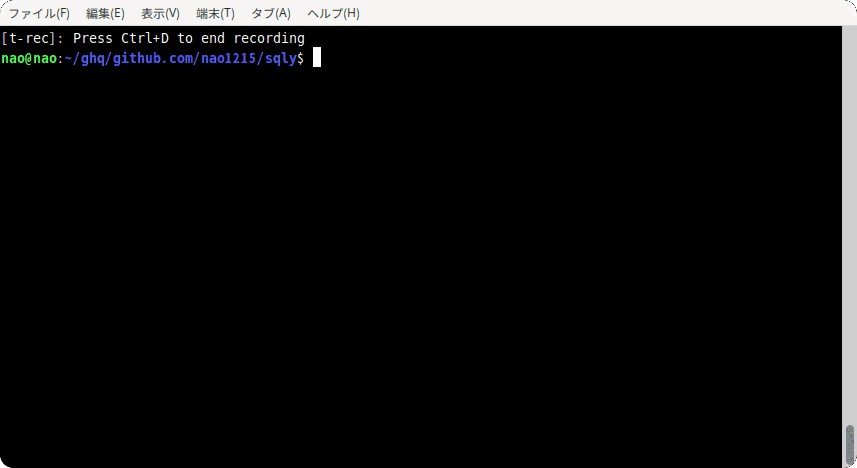

# prompt

[](https://pkg.go.dev/github.com/nao1215/prompt)
[](https://goreportcard.com/report/github.com/nao1215/prompt)
[](https://github.com/nao1215/prompt/actions/workflows/unit_test.yml)


[日本語](./doc/ja/README.md) | [Русский](./doc/ru/README.md) | [中文](./doc/zh-cn/README.md) | [한국어](./doc/ko/README.md) | [Español](./doc/es/README.md) | [Français](./doc/fr/README.md)


prompt is a terminal prompt library for Go for building interactive command-line interfaces. It is a maintained replacement for the archived [c-bata/go-prompt](https://github.com/c-bata/go-prompt), keeping the same core idea, a read loop with completion and history, while running on Linux, macOS, and Windows.



## Features

- Tab completion, including fuzzy matching, with customizable suggestions
- Command history with arrow-key navigation, persistence, and reverse search (Ctrl+R)
- Emacs-style key bindings
- Multi-line input with cursor navigation
- Built-in color themes
- A small API using the functional options pattern
- Runs on Linux, macOS, and Windows

## Installation

```bash
go get github.com/nao1215/prompt
```

Building needs Go 1.24 or later.

## Quick start

### Basic usage

```go
package main

import (
    "errors"
    "fmt"
    "log"
    "github.com/nao1215/prompt"
)

func main() {
    p, err := prompt.New("$ ")
    if err != nil {
        log.Fatal(err)
    }
    defer p.Close()

    for {
        input, err := p.Run()
        if err != nil {
            if errors.Is(err, prompt.ErrEOF) {
                fmt.Println("Goodbye!")
                break
            }
            log.Printf("Error: %v\n", err)
            continue
        }

        if input == "exit" {
            break
        }
        fmt.Printf("You entered: %s\n", input)
    }
}
```

### With auto-completion

```go
package main

import (
    "errors"
    "log"
    "github.com/nao1215/prompt"
)

func completer(d prompt.Document) []prompt.Suggestion {
    return []prompt.Suggestion{
        {Text: "help", Description: "Show help message"},
        {Text: "users", Description: "List all users"},
        {Text: "groups", Description: "List all groups"},
        {Text: "exit", Description: "Exit the program"},
    }
}

func main() {
    p, err := prompt.New("myapp> ",
        prompt.WithCompleter(completer),
        prompt.WithColorScheme(prompt.ThemeNightOwl),
    )
    if err != nil {
        log.Fatal(err)
    }
    defer p.Close()

    for {
        input, err := p.Run()
        if err != nil {
            if errors.Is(err, prompt.ErrEOF) {
                break
            }
            continue
        }

        if input == "exit" {
            break
        }
        // Handle commands...
    }
}
```

### With history and a context deadline

```go
package main

import (
    "context"
    "errors"
    "fmt"
    "log"
    "time"
    "github.com/nao1215/prompt"
)

func main() {
    p, err := prompt.New(">>> ",
        prompt.WithMemoryHistory(100),
        prompt.WithColorScheme(prompt.ThemeDracula),
    )
    if err != nil {
        log.Fatal(err)
    }
    defer p.Close()

    ctx, cancel := context.WithTimeout(context.Background(), 30*time.Second)
    defer cancel()

    input, err := p.RunWithContext(ctx)
    if errors.Is(err, context.DeadlineExceeded) {
        fmt.Println("Timeout reached")
        return
    }

    fmt.Printf("Input: %s\n", input)
}
```

### SQL-like interactive shell

```go
package main

import (
    "errors"
    "fmt"
    "log"
    "strings"
    "github.com/nao1215/prompt"
)

func sqlCompleter(d prompt.Document) []prompt.Suggestion {
    keywords := []string{
        "SELECT", "FROM", "WHERE", "INSERT", "UPDATE",
        "DELETE", "CREATE TABLE", "DROP TABLE",
    }

    suggestions := []prompt.Suggestion{}
    input := strings.ToUpper(d.GetWordBeforeCursor())

    for _, keyword := range keywords {
        if strings.HasPrefix(keyword, input) {
            suggestions = append(suggestions, prompt.Suggestion{
                Text: keyword,
                Description: "SQL keyword",
            })
        }
    }
    return suggestions
}

func main() {
    p, err := prompt.New("sql> ",
        prompt.WithCompleter(sqlCompleter),
        prompt.WithMemoryHistory(50),
    )
    if err != nil {
        log.Fatal(err)
    }
    defer p.Close()

    for {
        query, err := p.Run()
        if err != nil {
            if errors.Is(err, prompt.ErrEOF) {
                break
            }
            continue
        }

        if query == "exit" || query == "quit" {
            break
        }

        if strings.TrimSpace(query) != "" {
            fmt.Printf("Executing: %s\n", query)
            // Execute SQL query here...
        }
    }
}
```

## Advanced usage

### Fuzzy completion

```go
commands := []string{
    "git status", "git commit", "git push", "git pull",
    "docker run", "docker build", "docker ps",
    "kubectl get", "kubectl apply", "kubectl delete",
}

fuzzyCompleter := prompt.NewFuzzyCompleter(commands)

p, err := prompt.New("$ ",
    prompt.WithCompleter(fuzzyCompleter),
)
```

### Custom key bindings

```go
keyMap := prompt.NewDefaultKeyMap()
// Bind Ctrl+L to clear the line.
keyMap.Bind('\x0C', prompt.ActionDeleteLine)

p, err := prompt.New("$ ",
    prompt.WithKeyMap(keyMap),
)
```

### Persistent history

```go
historyConfig := &prompt.HistoryConfig{
    Enabled:     true,
    MaxEntries:  1000,
    File:        "/home/user/.myapp_history",
    MaxFileSize: 1024 * 1024, // 1MB
    MaxBackups:  3,
}

p, err := prompt.New("$ ",
    prompt.WithHistory(historyConfig),
)
```

### Multi-line submit control

In multiline mode, `WithIsComplete` decides whether Enter submits the buffer or
starts a new line. It receives the whole buffer and returns true when the input
is ready to run, so an app can buffer multi-line input such as SQL until a
trailing `;`. Backslash continuation and bracketed paste are unaffected.

```go
isComplete := func(input string) bool {
    return strings.HasSuffix(strings.TrimSpace(input), ";")
}

p, err := prompt.New("sql> ",
    prompt.WithMultiline(true),
    prompt.WithIsComplete(isComplete),
)
```

## Key bindings

| Key | Action |
|-----|--------|
| Enter | Submit input |
| Ctrl+C | Cancel and return ErrInterrupted |
| Ctrl+D | EOF when buffer is empty |
| ↑/↓ | Navigate history (or lines in multi-line mode) |
| ←/→ | Move cursor |
| Ctrl+A / Home | Move to beginning of line |
| Ctrl+E / End | Move to end of line |
| Ctrl+K | Delete from cursor to end of line |
| Ctrl+U | Delete entire line |
| Ctrl+W | Delete word backwards |
| Ctrl+R | Reverse history search |
| Tab | Auto-completion |
| Backspace | Delete character backwards |
| Delete | Delete character forwards |
| Ctrl+←/→ | Move by word boundaries |

## Color themes

```go
// Available themes
prompt.ThemeDefault
prompt.ThemeDracula
prompt.ThemeNightOwl
prompt.ThemeMonokai
prompt.ThemeSolarizedDark
prompt.ThemeSolarizedLight

// Usage
p, err := prompt.New("$ ",
    prompt.WithColorScheme(prompt.ThemeDracula),
)
```

## Examples

The [example](./example) directory has complete programs:

- [Basic usage](./example/basic) - a simple prompt
- [Auto-completion](./example/autocomplete) - tab completion with suggestions
- [Command history](./example/history) - history navigation and persistence
- [Multi-line input](./example/multiline) - multi-line editing
- [Interactive shell](./example/shell) - a file explorer shell

## Notes

### Thread safety

This library is not thread-safe. Do not share a prompt instance across
goroutines, call its methods concurrently, or call `Close()` while `Run()` is
active in another goroutine. Use a separate instance per goroutine if you need
concurrency.

### Error handling

`Run` and `RunWithContext` return specific errors:

- `prompt.ErrEOF`: Ctrl+D on an empty buffer
- `prompt.ErrInterrupted`: Ctrl+C
- `context.DeadlineExceeded`: the context deadline passed (with `RunWithContext`)
- `context.Canceled`: the context was cancelled

## Contributing

Contributions are welcome; see the [Contributing Guide](./CONTRIBUTING.md). A
GitHub Star also helps and motivates development. Development needs Go 1.24 or
later and golangci-lint, with tests run on Linux, macOS, and Windows.

## License

This project is licensed under the MIT License. See [LICENSE](LICENSE) for details.
