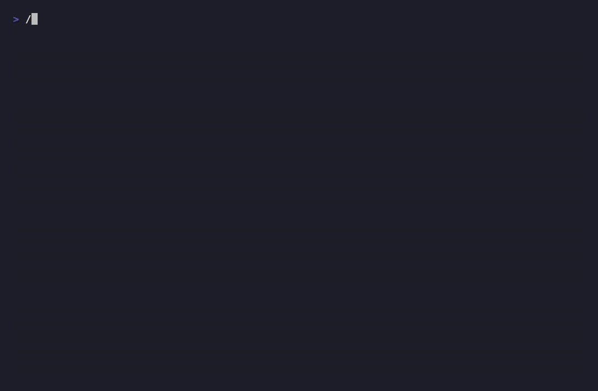

# prompt

[](https://pkg.go.dev/github.com/nao1215/prompt)
[](https://goreportcard.com/report/github.com/nao1215/prompt)
[](https://github.com/nao1215/prompt/actions/workflows/unit_test.yml)


prompt is a terminal prompt library for Go for building interactive command-line interfaces. It is a maintained replacement for the archived [c-bata/go-prompt](https://github.com/c-bata/go-prompt), keeping the same core idea, a read loop with completion and history, while running on Linux, macOS, and Windows.



## Features

- Tab completion, including fuzzy matching, with customizable suggestions and completer-chosen replacement spans
- Command history with arrow-key navigation, persistence, and reverse search (Ctrl+R)
- Emacs-style key bindings
- Multi-line input with cursor navigation
- Built-in color themes
- A small API using the functional options pattern
- Runs on Linux, macOS, and Windows

## Installation

```bash
go get github.com/nao1215/prompt
```

Building needs Go 1.24 or later.

## Quick start

### Basic usage

```go
package main

import (
    "errors"
    "fmt"
    "log"
    "github.com/nao1215/prompt"
)

func main() {
    p, err := prompt.New("$ ")
    if err != nil {
        log.Fatal(err)
    }
    defer p.Close()

    for {
        input, err := p.Run()
        if err != nil {
            if errors.Is(err, prompt.ErrEOF) {
                fmt.Println("Goodbye!")
                break
            }
            log.Printf("Error: %v\n", err)
            continue
        }

        if input == "exit" {
            break
        }
        fmt.Printf("You entered: %s\n", input)
    }
}
```

### With auto-completion

```go
package main

import (
    "errors"
    "log"
    "github.com/nao1215/prompt"
)

func completer(d prompt.Document) []prompt.Suggestion {
    return []prompt.Suggestion{
        {Text: "help", Description: "Show help message"},
        {Text: "users", Description: "List all users"},
        {Text: "groups", Description: "List all groups"},
        {Text: "exit", Description: "Exit the program"},
    }
}

func main() {
    p, err := prompt.New("myapp> ",
        prompt.WithCompleter(completer),
        prompt.WithColorScheme(prompt.ThemeNightOwl),
    )
    if err != nil {
        log.Fatal(err)
    }
    defer p.Close()

    for {
        input, err := p.Run()
        if err != nil {
            if errors.Is(err, prompt.ErrEOF) {
                break
            }
            continue
        }

        if input == "exit" {
            break
        }
        // Handle commands...
    }
}
```

### With history and a context deadline

```go
package main

import (
    "context"
    "errors"
    "fmt"
    "log"
    "time"
    "github.com/nao1215/prompt"
)

func main() {
    p, err := prompt.New(">>> ",
        prompt.WithMemoryHistory(100),
        prompt.WithColorScheme(prompt.ThemeDracula),
    )
    if err != nil {
        log.Fatal(err)
    }
    defer p.Close()

    ctx, cancel := context.WithTimeout(context.Background(), 30*time.Second)
    defer cancel()

    input, err := p.RunWithContext(ctx)
    if errors.Is(err, context.DeadlineExceeded) {
        fmt.Println("Timeout reached")
        return
    }

    fmt.Printf("Input: %s\n", input)
}
```

### SQL-like interactive shell

```go
package main

import (
    "errors"
    "fmt"
    "log"
    "strings"
    "github.com/nao1215/prompt"
)

func sqlCompleter(d prompt.Document) []prompt.Suggestion {
    keywords := []string{
        "SELECT", "FROM", "WHERE", "INSERT", "UPDATE",
        "DELETE", "CREATE TABLE", "DROP TABLE",
    }

    suggestions := []prompt.Suggestion{}
    input := strings.ToUpper(d.GetWordBeforeCursor())

    for _, keyword := range keywords {
        if strings.HasPrefix(keyword, input) {
            suggestions = append(suggestions, prompt.Suggestion{
                Text: keyword,
                Description: "SQL keyword",
            })
        }
    }
    return suggestions
}

func main() {
    p, err := prompt.New("sql> ",
        prompt.WithCompleter(sqlCompleter),
        prompt.WithMemoryHistory(50),
    )
    if err != nil {
        log.Fatal(err)
    }
    defer p.Close()

    for {
        query, err := p.Run()
        if err != nil {
            if errors.Is(err, prompt.ErrEOF) {
                break
            }
            continue
        }

        if query == "exit" || query == "quit" {
            break
        }

        if strings.TrimSpace(query) != "" {
            fmt.Printf("Executing: %s\n", query)
            // Execute SQL query here...
        }
    }
}
```

## Advanced usage

### Fuzzy completion

```go
commands := []string{
    "git status", "git commit", "git push", "git pull",
    "docker run", "docker build", "docker ps",
    "kubectl get", "kubectl apply", "kubectl delete",
}

fuzzyCompleter := prompt.NewFuzzyCompleter(commands)

p, err := prompt.New("$ ",
    prompt.WithCompleter(fuzzyCompleter),
)
```

### Completing a span of your own choosing

By default the prompt decides what a suggestion replaces: it takes the word
before the cursor and keeps a suggestion only when the word is a case-sensitive
prefix of it. A completer that matches by another rule can name the span itself,
and the prompt then applies that span literally and skips its own filter.

`Replace` is counted in runes, the same unit as `Document.CursorPosition`.

```go
func completer(d prompt.Document) []prompt.Suggestion {
    word := d.GetWordBeforeCursor()
    start := d.CursorPosition - len([]rune(word))

    var out []prompt.Suggestion
    for _, kw := range []string{"SELECT", "INSERT", "UPDATE"} {
        // Match case-insensitively, which the built-in filter cannot do.
        if strings.HasPrefix(strings.ToLower(kw), strings.ToLower(word)) {
            out = append(out, prompt.Suggestion{
                Text:    kw,
                Replace: &prompt.Range{Start: start, End: d.CursorPosition},
            })
        }
    }
    return out
}
```

Typing `sel` and pressing Tab now yields `SELECT`. Leave `Replace` nil to keep
the word-based behavior.

### Custom key bindings

```go
keyMap := prompt.NewDefaultKeyMap()
// Bind Ctrl+L to clear the line.
keyMap.Bind('\x0C', prompt.ActionDeleteLine)

p, err := prompt.New("$ ",
    prompt.WithKeyMap(keyMap),
)
```

### Persistent history

```go
historyConfig := &prompt.HistoryConfig{
    Enabled:     true,
    MaxEntries:  1000,
    File:        "/home/user/.myapp_history",
    MaxFileSize: 1024 * 1024, // 1MB
    MaxBackups:  3,
}

p, err := prompt.New("$ ",
    prompt.WithHistory(historyConfig),
)
```

### Multi-line submit control

In multiline mode, `WithIsComplete` decides whether Enter submits the buffer or
starts a new line. It receives the whole buffer and returns true when the input
is ready to run, so an app can buffer multi-line input such as SQL until a
trailing `;`. Backslash continuation and bracketed paste are unaffected.

```go
isComplete := func(input string) bool {
    return strings.HasSuffix(strings.TrimSpace(input), ";")
}

p, err := prompt.New("sql> ",
    prompt.WithMultiline(true),
    prompt.WithIsComplete(isComplete),
)
```

Pair it with `WithContinuationPrefix` so a buffered line says it is waiting.
Without one, a statement `IsComplete` declined leaves the cursor on a bare line
with nothing in front of it, which is indistinguishable from a hung program:

```go
p, err := prompt.New("sql> ",
    prompt.WithMultiline(true),
    prompt.WithIsComplete(isComplete),
    prompt.WithContinuationPrefix(" ..> "),
)
```

```text
sql> SELECT id,
 ..> name FROM users;
```

The prefix is drawn in the prompt's color and counted when positioning the cursor
and measuring how many rows the input occupies, so editing a continuation line
lands where the character is. It never appears in the returned input. Use
`SetContinuationPrefix` to change it between calls, as `SetPrefix` does for the
main prefix.

### Persistent raw mode (REPL loops)

A REPL that calls `Run` once per line normally enters raw mode at the start of
each call and restores it when the call returns. Between one line's restore and
the next line's re-acquisition the read loop is not consuming input, so bytes that
a fast or automated driver (a pipe or pseudo-terminal) sends right after the
prompt is re-rendered can be lost, making scripted sessions hang intermittently.

`WithPersistentRawMode` keeps the terminal in raw mode across consecutive `Run`
calls, closing that window and making input deterministic regardless of timing or
load. Raw mode is acquired once on the first `Run` and released once — by `Close`
or when input reaches EOF. Ctrl+C does not release it, because it ends the line
rather than the session and the next `Run` continues where it left off. Because the terminal stays in
raw mode between calls, print your own output between prompts with `\r\n` rather
than `\n`.

```go
p, err := prompt.New("$ ",
    prompt.WithPersistentRawMode(),
)
if err != nil {
    log.Fatal(err)
}
defer p.Close()

for {
    line, err := p.Run()
    if errors.Is(err, prompt.ErrEOF) || errors.Is(err, prompt.ErrInterrupted) {
        break
    }
    if err != nil {
        log.Fatal(err)
    }
    fmt.Printf("you typed: %s\r\n", line) // note the \r\n
}
```

### Indenting continuation lines

`WithAutoIndent` decides what each new line opens with. It is called with the
input up to where the line breaks, and what it returns is inserted at the start
of the new line:

```go
p, err := prompt.New("sql> ",
    prompt.WithMultiline(true),
    prompt.WithIsComplete(func(in string) bool { return strings.HasSuffix(in, ";") }),
    prompt.WithContinuationPrefix("...> "),
    prompt.WithAutoIndent(func(before string) string {
        // Keep the indentation of the line being continued.
        line := before[strings.LastIndex(before, "\n")+1:]
        return line[:len(line)-len(strings.TrimLeft(line, " \t"))]
### Coloring the input

`WithHighlighter` is given the whole input and returns the runs to draw in a
color of their own, as rune offsets into that input:

```go
p, err := prompt.New("sql> ",
    prompt.WithHighlighter(func(input string) []prompt.StyleSpan {
        var spans []prompt.StyleSpan
        for _, kw := range keywordRuns(input) { // your lexer
            spans = append(spans, prompt.StyleSpan{
                Start: kw.start, End: kw.end,
                Color: prompt.Color{R: 198, G: 120, B: 221, Bold: true},
            })
        }
        return spans
    }),
)
```

What it returns is part of the input, so it is submitted and recorded in history
like anything else typed.
Everything no run covers keeps the scheme's input color. The highlighter
decides colors and nothing else: the input is drawn exactly as it is, and the
prompt measures its layout from that text, so highlighting cannot move the
cursor or wrap a line early. It is called on every render, so it should be cheap
over a line's worth of text.

### Handing the terminal to another program

A prompt owns the terminal while it lives. To run an editor, a pager, or any
other program that draws on the terminal, close the prompt and open a new one
afterwards:

```go
if err := p.Close(); err != nil {
    return err
}

cmd := exec.Command(os.Getenv("EDITOR"), path)
cmd.Stdin, cmd.Stdout, cmd.Stderr = os.Stdin, os.Stdout, os.Stderr
if err := cmd.Run(); err != nil {
    return err
}

p, err := prompt.New("$ ", opts...) // a fresh session takes the terminal back
if err != nil {
    return err
}
```

On Unix, `Close` ends the goroutine reading the terminal before it returns, so
the child process and the next prompt get the input typed into them. On Windows
input is read through go-tty, whose read cannot be interrupted, so `Close` does
not wait for it: a prompt opened there while an earlier reader is still blocked
may lose keystrokes to it.

### Interrupting work between prompts

`Run` returns as soon as a line is submitted, so while the application executes
that line nothing is reading the terminal. In raw mode Ctrl+C is a byte rather
than a signal, so it cannot reach the running work: it waits in the input buffer
and is read as part of the next line once the work is over.

`WatchInterrupt` watches for it during that gap and returns a context canceled
when the key arrives:

```go
for {
    line, err := p.Run()
    if errors.Is(err, prompt.ErrEOF) {
        break // Ctrl+D at an empty prompt ends the session
    }
    if errors.Is(err, prompt.ErrInterrupted) {
        continue // Ctrl+C discards the line being typed
    }
    if err != nil {
        return err
    }

    ctx, stop := p.WatchInterrupt(context.Background())
    err = runQuery(ctx, line) // a long query, an import, anything slow
    stop()

    if errors.Is(err, context.Canceled) {
        fmt.Print("canceled\r\n")
        continue
    }
    if err != nil {
        fmt.Printf("%v\r\n", err)
    }
}
```

Everything else typed while the work runs belongs to the next line: it is held
and delivered to the following `Run` in the order it was typed, so typing ahead
keeps working. Do not call `Run` while a watch is active — a line editor and a
watcher cannot both own one terminal.

## Key bindings

| Key | Action |
|-----|--------|
| Enter | Submit input |
| Ctrl+C | Discard the current line and return ErrInterrupted |
| Ctrl+D | EOF when buffer is empty |
| ↑/↓ | Navigate history (or lines in multi-line mode) |
| ←/→ | Move cursor |
| Ctrl+A / Home | Move to beginning of line |
| Ctrl+E / End | Move to end of line |
| Ctrl+K | Delete from cursor to end of line |
| Ctrl+U | Delete entire line |
| Ctrl+W | Delete word backwards |
| Ctrl+R | Reverse history search |
| Tab | Auto-completion |
| Backspace | Delete character backwards |
| Delete | Delete character forwards |
| Ctrl+←/→ | Move by word boundaries |
| Esc | Close the completion popup |

## Color themes

```go
// Available themes
prompt.ThemeDefault
prompt.ThemeDracula
prompt.ThemeNightOwl
prompt.ThemeMonokai
prompt.ThemeSolarizedDark
prompt.ThemeSolarizedLight

// Usage
p, err := prompt.New("$ ",
    prompt.WithColorScheme(prompt.ThemeDracula),
)
```

## Examples

The [example](./example) directory has complete programs:

- [Basic usage](./example/basic) - a simple prompt
- [Auto-completion](./example/autocomplete) - tab completion with suggestions
- [Command history](./example/history) - history navigation and persistence
- [Multi-line input](./example/multiline) - multi-line editing
- [Interactive shell](./example/shell) - a file explorer shell

## Notes

### Thread safety

This library is not thread-safe. Do not share a prompt instance across
goroutines, call its methods concurrently, or call `Close()` while `Run()` is
active in another goroutine. Use a separate instance per goroutine if you need
concurrency.

### Error handling

`Run` and `RunWithContext` return specific errors:

- `prompt.ErrEOF`: Ctrl+D on an empty buffer
- `prompt.ErrInterrupted`: Ctrl+C
- `context.DeadlineExceeded`: the context deadline passed (with `RunWithContext`)
- `context.Canceled`: the context was canceled

## Contributing

Contributions are welcome; see the [Contributing Guide](./CONTRIBUTING.md). A
GitHub Star also helps and motivates development. Development needs Go 1.24 or
later and golangci-lint, with tests run on Linux, macOS, and Windows.

## License

This project is licensed under the MIT License. See [LICENSE](LICENSE) for details.
