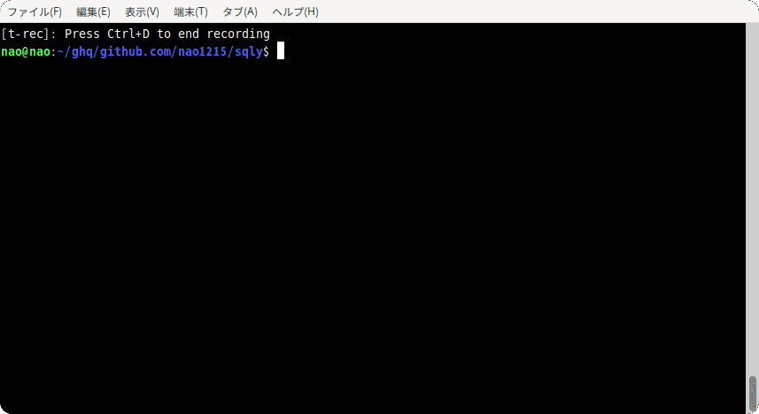

# prompt

[](https://pkg.go.dev/github.com/nao1215/prompt)
[](https://goreportcard.com/report/github.com/nao1215/prompt)
[](https://github.com/nao1215/prompt/actions/workflows/unit_test.yml)

[English](../../README.md) | [日本語](../ja/README.md) | [Русский](../ru/README.md) | [中文](../zh-cn/README.md) | **한국어** | [Español](../es/README.md) | [Français](../fr/README.md)


**prompt**는 강력한 대화형 명령줄 인터페이스를 제공하는 Go용 간단한 터미널 프롬프트 라이브러리입니다. 이 라이브러리는 유지보수되지 않는 [c-bata/go-prompt](https://github.com/c-bata/go-prompt) 라이브러리의 대체제로 설계되어, 중요한 문제들을 해결하면서 향상된 기능과 더 나은 크로스 플랫폼 지원을 추가합니다.



## 🎯 왜 prompt인가요?

원래 [go-prompt](https://github.com/c-bata/go-prompt) 라이브러리는 2021년 3월부터 유지보수되지 않고 있으며, 286개의 열린 이슈와 다음과 같은 수많은 중요한 버그들이 있습니다:

- **터미널 렌더링에서 0으로 나누기 패닉** (이슈 #277)
- **Windows 터미널 호환성 문제** (이슈 #285)
- **/dev/tty 처리에서 파일 디스크립터 누수** (이슈 #253)
- **STDIN 이외의 제한적인 TTY 지원** (이슈 #275)
- **애플리케이션 종료 시 터미널 색상 리셋 문제** (이슈 #265)

이 라이브러리는 포괄적인 테스트 커버리지를 갖춘 더 간단하고 유지보수 가능한 코드베이스를 제공하면서 이러한 모든 문제를 해결합니다.

## ✨ 기능

- 🖥️ **크로스 플랫폼 지원** - Linux, macOS, Windows에서 완벽하게 작동
- 🔍 **고급 자동완성** - 퍼지 매칭과 사용자 정의 가능한 제안이 있는 Tab 완성
- 📚 **명령 히스토리** - 화살표 키 탐색, 영구 히스토리, 역방향 검색 (Ctrl+R)
- ⌨️ **풍부한 키 바인딩** - Emacs 스타일 탐색을 포함한 포괄적인 단축키
- 🌈 **색상 테마** - 내장 색상 스키마와 사용자 정의 가능한 테마
- 📝 **멀티라인 입력** - 적절한 커서 탐색이 있는 멀티라인 입력 지원
- ⚡ **고성능** - 효율적인 렌더링과 최소한의 할당
- 🧪 **포괄적인 테스트** - 광범위한 크로스 플랫폼 테스트로 54.5% 테스트 커버리지
- 🔧 **간단한 API** - 함수 옵션 패턴을 사용한 깔끔하고 현대적인 API 설계
- 🛠️ **리소스 관리** - 적절한 정리와 파일 디스크립터 누수 없음

## 📦 설치

```bash
go get github.com/nao1215/prompt
```

## 🔧 요구사항

- **Go 버전**: 1.24 이상
- **운영 체제**:
  - Linux
  - macOS
  - Windows

## 🚀 빠른 시작

### 기본 사용법

```go
package main

import (
    "errors"
    "fmt"
    "log"
    "github.com/nao1215/prompt"
)

func main() {
    p, err := prompt.New("$ ")
    if err != nil {
        log.Fatal(err)
    }
    defer p.Close()

    for {
        input, err := p.Run()
        if err != nil {
            if errors.Is(err, prompt.ErrEOF) {
                fmt.Println("안녕히 가세요!")
                break
            }
            log.Printf("오류: %v\n", err)
            continue
        }

        if input == "exit" {
            break
        }
        fmt.Printf("입력하신 내용: %s\n", input)
    }
}
```

### 자동완성과 함께

```go
package main

import (
    "errors"
    "log"
    "github.com/nao1215/prompt"
)

func completer(d prompt.Document) []prompt.Suggestion {
    return []prompt.Suggestion{
        {Text: "help", Description: "도움말 메시지 표시"},
        {Text: "users", Description: "모든 사용자 목록"},
        {Text: "groups", Description: "모든 그룹 목록"},
        {Text: "exit", Description: "프로그램 종료"},
    }
}

func main() {
    p, err := prompt.New("myapp> ",
        prompt.WithCompleter(completer),
        prompt.WithColorScheme(prompt.ThemeNightOwl),
    )
    if err != nil {
        log.Fatal(err)
    }
    defer p.Close()

    for {
        input, err := p.Run()
        if err != nil {
            if errors.Is(err, prompt.ErrEOF) {
                break
            }
            continue
        }

        if input == "exit" {
            break
        }
        // 명령 처리...
    }
}
```

### 히스토리와 고급 기능과 함께

```go
package main

import (
    "context"
    "fmt"
    "log"
    "time"
    "github.com/nao1215/prompt"
)

func main() {
    // 히스토리와 타임아웃이 있는 프롬프트 생성
    p, err := prompt.New(">>> ",
        prompt.WithMemoryHistory(100),
        prompt.WithColorScheme(prompt.ThemeDracula),
    )
    if err != nil {
        log.Fatal(err)
    }
    defer p.Close()

    // 타임아웃 지원을 위한 컨텍스트 사용
    ctx, cancel := context.WithTimeout(context.Background(), 30*time.Second)
    defer cancel()

    input, err := p.RunWithContext(ctx)
    if err == context.DeadlineExceeded {
        fmt.Println("타임아웃에 도달했습니다")
        return
    }

    fmt.Printf("입력: %s\n", input)
}
```

## ⌨️ 키 바인딩

라이브러리는 처음부터 포괄적인 키 바인딩을 지원합니다:

| 키 | 동작 |
|----|------|
| Enter | 입력 제출 |
| Ctrl+C | 취소하고 ErrInterrupted 반환 |
| Ctrl+D | 버퍼가 비어있을 때 EOF |
| ↑/↓ | 히스토리 탐색 (멀티라인 모드에서는 줄) |
| ←/→ | 커서 이동 |
| Ctrl+A / Home | 줄 시작으로 이동 |
| Ctrl+E / End | 줄 끝으로 이동 |
| Ctrl+K | 커서부터 줄 끝까지 삭제 |
| Ctrl+U | 전체 줄 삭제 |
| Ctrl+W | 뒤쪽 단어 삭제 |
| Ctrl+R | 히스토리 역방향 검색 |
| Tab | 자동완성 |
| Backspace | 뒤쪽 문자 삭제 |
| Delete | 앞쪽 문자 삭제 |
| Ctrl+←/→ | 단어 경계로 이동 |

## 🎨 색상 테마

내장 색상 테마:

```go
// 사용 가능한 테마
prompt.ThemeDefault
prompt.ThemeDracula
prompt.ThemeNightOwl
prompt.ThemeMonokai
prompt.ThemeSolarizedDark
prompt.ThemeSolarizedLight

// 사용법
p, err := prompt.New("$ ",
    prompt.WithColorScheme(prompt.ThemeDracula),
)
```

## ⚠️ 중요한 참고사항

### 스레드 안전성
⚠️ **중요**: 이 라이브러리는 **스레드 안전하지 않습니다**:
- **고루틴 간에 프롬프트 인스턴스를 공유하지 마세요**
- **같은 프롬프트 인스턴스에서 메서드를 동시에 호출하지 마세요**
- **다른 고루틴에서 `Run()`이 활성화되어 있는 동안 `Close()`를 호출하지 마세요**
- 필요한 경우 동시 작업을 위해 별도의 프롬프트 인스턴스를 사용하세요

### 리소스 관리
- **프롬프트 작업이 끝나면 항상 `Close()`를 호출하여** 리소스 누수를 방지하세요
- `Close()` 메서드는 여러 번 호출해도 안전합니다
- `Run()` 또는 `RunWithContext()`가 오류를 반환하더라도 `Close()`를 호출하세요

### 오류 처리
라이브러리는 특정 오류 타입을 제공합니다:
- `prompt.ErrEOF`: 사용자가 버퍼가 비어있는 상태에서 Ctrl+D를 눌렀음
- `prompt.ErrInterrupted`: 사용자가 Ctrl+C를 눌렀음
- `context.DeadlineExceeded`: 타임아웃에 도달함 (컨텍스트 사용 시)
- `context.Canceled`: 컨텍스트가 취소됨

## 🧪 테스트

테스트 스위트 실행:

```bash
make test    # 커버리지와 함께 테스트 실행
make lint    # 린터 실행
make clean   # 생성된 파일 정리
```

## 🤝 기여

기여를 환영합니다! 자세한 내용은 [기여 가이드](../../CONTRIBUTING.md)를 참조하세요.

### 개발 요구사항

- Go 1.24 이상
- 코드 품질을 위한 golangci-lint
- Linux, macOS, Windows에서의 크로스 플랫폼 테스트

## 💖 지원

이 프로젝트가 유용하다고 생각되시면 다음을 고려해 주세요:

- ⭐ GitHub에서 스타 주기 - 다른 사람들이 프로젝트를 발견하는 데 도움이 됩니다
- 💝 [스폰서 되기](https://github.com/sponsors/nao1215) - 여러분의 지원이 프로젝트를 유지하고 지속적인 개발에 동기를 부여합니다

스타, 스폰서십, 기여를 통한 여러분의 지원이 이 프로젝트를 발전시키는 원동력입니다. 감사합니다!

## 📄 라이선스

이 프로젝트는 MIT 라이선스 하에 라이선스됩니다 - 자세한 내용은 [LICENSE](../../LICENSE) 파일을 참조하세요.